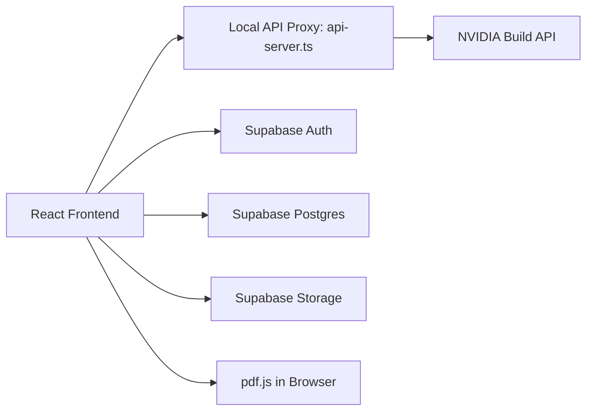

# Horizon AI

<div align="center">

> Transform Learning into Career Success
> The world's most intelligent personal learning companion


**[Features](#features) • [Quick Start](#quick-start) • [Architecture](#system-architecture) • [Security](#security-notes) • [Deployment](#deployment)**

</div>

---

## Why Horizon AI

Horizon AI helps learners answer three hard questions with precision:

1. What should I learn next?
2. How should I learn it based on my profile?
3. How do I turn learning into employable outcomes?

It delivers a complete flow from onboarding to roadmap execution, weekly validation, and resume readiness.

---

## Features

- Deep profile-aware personalization using academic stage, stream, branch, specialization, learning style, focus area, and performance history.
- Intelligent roadmap generation with practical, week-by-week milestones and resource curation.
- Built-in resume upload and analysis loop for career alignment.
- Role-aware experience for Learners, Trainers, and Policymakers.
- Resilient AI proxy with multi-key routing, failover, and cooldown handling.

---

## Product Experience

### Learner
- Smart onboarding with profile capture.
- Personalized roadmap generation.
- Weekly assessments and progress tracking.
- AI coach interactions and contextual study support.
- Resume upload, extraction, and analysis.

### Trainer
- Cohort-level prototype analytics.
- High-level learning progression visibility.

### Policymaker
- Macro-view prototype dashboards.
- Signals for regional skill demand and intervention planning.

---

## System Architecture



### Runtime Model

- Frontend: React + TypeScript + Vite + Tailwind CDN + custom CSS.
- AI Access: Server-side proxy using OpenAI SDK against the NVIDIA Build API.
- Data/Auth/Storage: Supabase.
- Resume Parsing: Client-side PDF extraction using pdf.js.

---

## Key Engineering Highlights

### 1) Multi-Key AI Routing and Reliability

- Supports multiple NVIDIA API keys.
- Handles retries and cooldown windows for rate limit and transient failure cases.
- Enforces model-key mapping policies in backend proxy.

### 2) Structured JSON-First AI Responses

- Prompt contracts are JSON-centric for safer UI rendering.
- Parsing guards ensure invalid payloads fail fast and visibly.

### 3) Profile-Driven Prompting

- Prompts include enriched user context.
- Roadmaps are tuned to academic and career signals instead of generic templates.

### 4) Resume Intelligence Pipeline

- Resume files are private in Supabase Storage.
- Signed URLs used for secure access.
- Text extraction is done client-side before AI analysis.

---

## Project Structure

```text
Final Horizon AI/
  api/
    chat.ts
    health.ts
  api-server.ts
  App.tsx
  index.html
  index.tsx
  components/
  services/
    geminiService.ts
    supabaseService.ts
  supabase_schema.sql
  types.ts
  vercel.json
  package.json
```

---

## Quick Start

### 1) Use the Correct Folder

Run commands from the project root that contains `package.json`:

```powershell
cd "<your-clone-folder>\Final Horizon AI"
```

### 2) Install Dependencies

```powershell
npm install
```

### 3) Configure Environment

Create a `.env` file in the project root:

```env
# Frontend
VITE_SUPABASE_URL=YOUR_SUPABASE_URL
VITE_SUPABASE_ANON_KEY=YOUR_SUPABASE_ANON_KEY
VITE_API_PROXY_BASE=http://localhost:3004/api

# Backend
NVIDIA_API_BASE=https://integrate.api.nvidia.com/v1
BACKEND_PORT=3004

# Key-to-model slots
NVIDIA_API_KEY_1=YOUR_KEY_FOR_GLM
NVIDIA_API_KEY_2=YOUR_KEY_FOR_LLAMA
NVIDIA_API_KEY_3=YOUR_KEY_FOR_MISTRAL

# Optional fallback key
NVIDIA_API_KEY=YOUR_FALLBACK_KEY

# Optional routing behavior
NVIDIA_KEY_RATE_LIMIT_COOLDOWN_MS=65000
NVIDIA_KEY_ERROR_COOLDOWN_MS=8000
NVIDIA_KEY_MAX_RETRIES=6
```

### 4) Set Up Supabase

Run [supabase_schema.sql](supabase_schema.sql) in the Supabase SQL Editor as `postgres`.

This file creates and secures the data model used by the app:

- `profiles`
- `roadmaps`
- `roadmap_weeks`
- `week_resources`
- `roadmap_global_resources`
- `quiz_results`
- the private `resumes` storage bucket and its RLS policies

### 5) Start Development

```powershell
npm run dev
```

Expected local endpoints:

- Frontend: `http://localhost:3000`
- API Proxy: `http://localhost:3004`
- Health Check: `http://localhost:3004/health`

If you want to run the two processes separately:

```powershell
npm run dev:frontend
npm run dev:backend
```

### 5) Production Vercel Pipeline (Industry Ready)

This repository now includes a production pipeline at:

- `.github/workflows/vercel-production-pipeline.yml`

Pipeline behavior:

1. Pull Requests to `main`
  - Runs strict quality gates: `npm ci`, `npm run typecheck`, `npm run build`, `npm audit --omit=dev --audit-level=critical`
  - Builds and deploys a Vercel Preview deployment when Vercel secrets are configured
2. Push to `main`
  - Re-runs quality gates
  - Performs a prebuilt Vercel production deployment (`vercel build --prod` + `vercel deploy --prebuilt --prod`)

Required GitHub repository secrets:

- `VERCEL_TOKEN`
- `VERCEL_ORG_ID`
- `VERCEL_PROJECT_ID`

Use `.env.example` as the source of truth for all required Vercel environment variables.

---

## Authentication

Horizon AI currently supports:

- Email/password sign-up and sign-in.
- Google OAuth via Supabase.
- Guest access for exploring the UI without cloud save.

If Supabase is not configured, the app shows a setup notice and still allows guest access. Session persistence and refresh are handled by Supabase Auth.

---

## AI Model and Key Mapping

Current intended mapping:

1. Key 1 -> `glm-4.7` / `z-ai/glm4.7`
2. Key 2 -> `meta/llama-3.1-405b-instruct`
3. Key 3 -> `mistralai/mistral-7b-instruct-v0.2`

The backend enforces model validation, round-robin key selection, cooldown windows, and a fallback from GLM 404s to the Llama route when provider availability changes.

---

## Security Notes

- Never commit `.env` with real keys.
- Keep the Supabase storage bucket `resumes` private.
- Use RLS policies for both profile and storage objects.
- Use signed URLs for resume reads.
- Keep NVIDIA API keys on the server or in deployment secrets, never in the browser bundle.
- The frontend should always talk to NVIDIA through the proxy or deployed API route.

---

## Deployment

### Vercel

The repo includes [api/chat.ts](api/chat.ts), [api/health.ts](api/health.ts), and [vercel.json](vercel.json) for Vercel deployments.

Recommended steps:

1. Add the environment variables in your Vercel project settings.
2. Run `npm run build`.
3. Deploy the project.
4. Verify `/api/health` responds and auth works.

### Other Hosts

If you are not using Vercel, host the built frontend and run [api-server.ts](api-server.ts) as a separate Node process.

For a production preview of the frontend build:

```powershell
npm run build
npm run preview
```

---

## Useful Files

- [App.tsx](App.tsx) - main app shell and routing.
- [api-server.ts](api-server.ts) - local Express proxy for NVIDIA requests.
- [api/chat.ts](api/chat.ts) - deployed chat route.
- [api/health.ts](api/health.ts) - deployed health route.
- [components/Auth.tsx](components/Auth.tsx) - email, Google, and guest access UI.
- [components/Dashboard.tsx](components/Dashboard.tsx) - profile, roadmap, and resume workflows.
- [index.html](index.html) - Tailwind CDN, fonts, pdf.js, and client bootstrap.
- [services/geminiService.ts](services/geminiService.ts) - AI request and roadmap logic.
- [services/supabaseService.ts](services/supabaseService.ts) - auth, database, and storage helpers.
- [supabase_schema.sql](supabase_schema.sql) - database schema and RLS setup.
- [types.ts](types.ts) - shared app types.

---

## Troubleshooting

### npm ENOENT package.json

You are in the wrong directory. Move to the project root that contains `package.json`.

```powershell
cd "<your-clone-folder>\Final Horizon AI"
```

### Port already in use (3000/3004)

```powershell
$ports = 3000,3001,3004
foreach ($p in $ports) {
  $pids = netstat -ano | Select-String ":$p" | ForEach-Object { ($_ -split '\s+')[-1] } |
    Where-Object { $_ -match '^[0-9]+$' } | Sort-Object -Unique
  foreach ($procId in $pids) {
    if ($procId -ne $PID) {
      try { Stop-Process -Id $procId -Force -ErrorAction Stop } catch {}
    }
  }
}
```

### Resume upload fails after file selection

- Ensure `supabase_schema.sql` executed successfully.
- Check `profiles` RLS policies and `storage.objects` policies.
- Verify bucket name is exactly `resumes`.
- Confirm user is logged in before upload.
- If you are on Vercel, confirm the deployed `/api/health` route works and the storage secrets are set.

---

## Roadmap

- Harden role-based analytics for trainer and policymaker workflows.
- Add observability dashboards for AI latency/error classes.
- Add automated model-availability fallback per provider account.
- Extend localization and accessibility coverage.

---

## Team

Built by Team Portgas D Ace for Smart India Hackathon.

---

## License

MIT License. See [LICENSE](LICENSE) for details.
