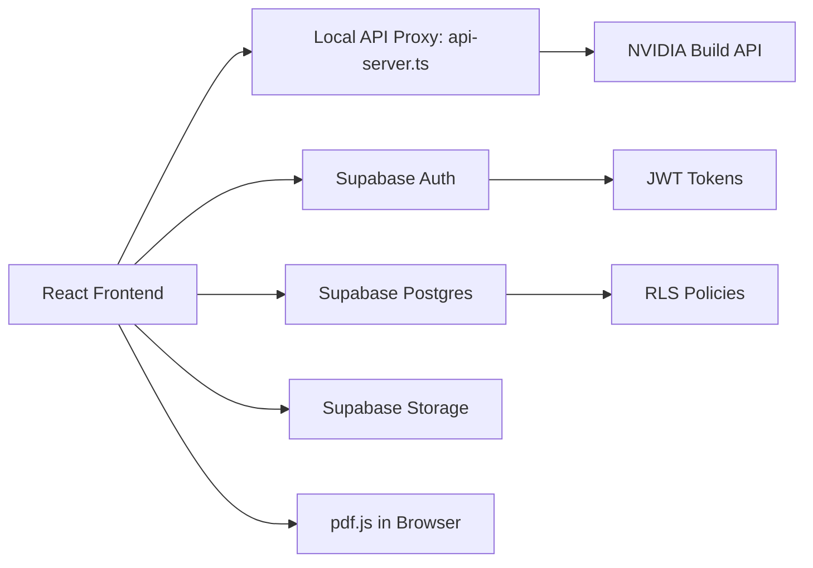
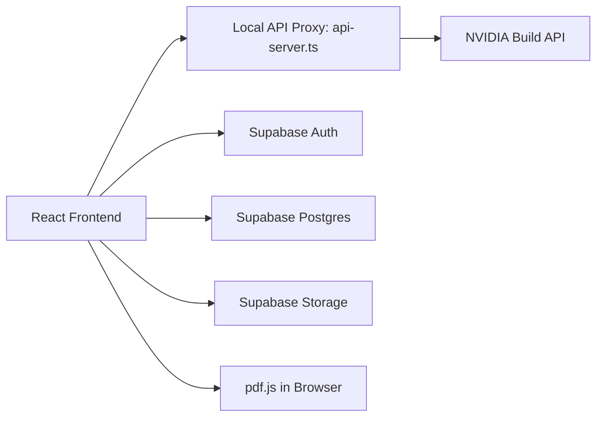

# Horizon AI

<p align="center">
  <strong>Your Learning and Career Navigation Engine</strong><br/>
  Personalized roadmaps, adaptive assessments, resume intelligence, and role-based skill insights.
</p>

<p align="center">
  
  
  
  
  
  
</p>

---

## 📚 Documentation Hub

**All documentation has been organized in the [`Markdown's/`](./Markdown's/) folder.**

### Quick Links
- 📖 **[Documentation Index](./Markdown's/INDEX.md)** - Complete documentation guide
- 🔐 **[Authentication Guide](./Markdown's/AUTHENTICATION_GUIDE.md)** - NEW! Complete auth system setup
- 🚀 **[Deployment Checklist](./Markdown's/DEPLOYMENT_CHECKLIST.md)** - Production deployment
- 🛡️ **[Security Blueprint](./Markdown's/SECURITY_BLUEPRINT_PHASE2.md)** - Security architecture

---

## Why Horizon AI

Horizon AI helps learners answer three hard questions with precision:

1. What should I learn next?
2. How should I learn it based on my profile?
3. How do I turn learning into employable outcomes?

It delivers a complete flow from onboarding to roadmap execution, weekly validation, and resume readiness.

---

## ✨ What Makes It Different

- Deep profile-aware personalization using academic stage, stream, branch, specialization, learning style, focus area, and performance history.
- Intelligent roadmap generation with practical, week-by-week milestones and resource curation.
- Built-in resume upload and analysis loop for career alignment.
- Role-aware experience for Learners, Trainers, and Policymakers.
- **🆕 Production-Grade Authentication with Google OAuth & Email/Password**
- **🆕 Real-Time Session Management with JWT Verification**
- **🆕 Row Level Security (RLS) on All User Data**
- Resilient AI proxy with multi-key routing, failover, and cooldown handling.

---

## 🔐 NEW: Secure Authentication System

### Features
✅ **Google Sign-In (OAuth 2.0)**
✅ **Email/Password Authentication**
✅ **Real-Time Session Management**
✅ **JWT Token Verification**
✅ **Row Level Security (RLS)**
✅ **Protected Routes**
✅ **Password Reset Flow**
✅ **Auto Token Refresh**
✅ **Backend Middleware**
✅ **Production Security Best Practices**

### Files Included
- `services/authService.ts` - Core Supabase auth service
- `components/AuthForm.tsx` - Login/Signup UI
- `contexts/AuthContext.tsx` - Auth state management
- `components/ProtectedRoute.tsx` - Protected route wrapper
- `api/auth-middleware.ts` - Backend JWT verification
- `database/rls-policies.sql` - RLS policies & database schema

### Quick Start (Auth)
→ **See [AUTHENTICATION_GUIDE.md](./Markdown's/AUTHENTICATION_GUIDE.md) for complete setup**

```tsx
import { useAuth } from './contexts/AuthContext';

function MyComponent() {
  const { user, isAuthenticated } = useAuth();
  return isAuthenticated ? <div>Welcome, {user?.email}!</div> : <div>Please log in</div>;
}
```

---

## Product Experience

### Learner
- Smart onboarding with profile capture.
- Personalized roadmap generation.
- Weekly assessments and progress tracking.
- AI coach interactions and contextual study support.
- Resume upload, extraction, and analysis.
- **🆕 Secure authentication with Google/Email**

### Trainer
- Cohort-level prototype analytics.
- High-level learning progression visibility.

### Policymaker
- Macro-view prototype dashboards.
- Signals for regional skill demand and intervention planning.

---

## System Architecture



### Runtime Model

- Frontend: React + TypeScript + Vite + Tailwind.
- Authentication: Supabase Auth with Google OAuth & Email/Password.
- Session Management: JWT tokens with real-time verification.
- Data/Auth/Storage: Supabase with RLS protection.
- AI Access: Server-side proxy using OpenAI SDK against NVIDIA endpoint.
- Resume Parsing: Client-side PDF extraction using pdf.js.

---

## Key Engineering Highlights

### 1) Multi-Layer Authentication & Authorization
- Supabase Auth with Google OAuth and Email/Password
- JWT token verification on backend
- Row Level Security (RLS) on all tables
- Protected routes with role-based access

### 2) Multi-Key AI Routing and Reliability
- Supports multiple NVIDIA API keys.
- Handles retries and cooldown windows for rate limit and transient failure cases.
- Enforces model-key mapping policies in backend proxy.

### 3) Structured JSON-First AI Responses
- Prompt contracts are JSON-centric for safer UI rendering.
- Parsing guards ensure invalid payloads fail fast and visibly.

### 4) Profile-Driven Prompting
- Prompts include enriched user context.
- Roadmaps are tuned to academic and career signals instead of generic templates.

### 5) Resume Intelligence Pipeline
- Resume files are private in Supabase Storage.
- Signed URLs used for secure access.
- Text extraction is done client-side before AI analysis.

---

## Project Structure

```text
Final Horizon AI/
  ├── api-server.ts
  ├── App.tsx
  ├── index.tsx
  ├── components/
  │   ├── AuthForm.tsx                  # 🆕 Auth UI
  │   ├── ProtectedRoute.tsx            # 🆕 Route protection
  │   └── ...
  ├── services/
  │   ├── authService.ts               # 🆕 Auth service
  │   ├── geminiService.ts
  │   └── supabaseService.ts
  ├── contexts/
  │   └── AuthContext.tsx              # 🆕 Auth state
  ├── api/
  │   └── auth-middleware.ts           # 🆕 JWT verification
  ├── database/
  │   └── rls-policies.sql             # 🆕 RLS & schema
  ├── Markdown's/                      # 📚 All documentation
  │   ├── INDEX.md
  │   ├── AUTHENTICATION_GUIDE.md      # 🆕
  │   ├── README_MAIN.md
  │   └── ...
  ├── supabase_schema.sql
  ├── .env
  └── package.json
```

---

## Quick Start

### 1) Use the Correct Folder

Run this project from:

```powershell
cd "D:\Projects\nvidia\Final Horizon AI"
```

Do not run from folders like `nvidia - Copy` if they do not contain `package.json`.

### 2) Install Dependencies

```powershell
npm install
```

### 3) Configure Environment

Create or update `.env.local`:

```env
# Frontend
VITE_API_PROXY_BASE=http://localhost:3004/api
VITE_SUPABASE_URL=YOUR_SUPABASE_URL
VITE_SUPABASE_ANON_KEY=YOUR_SUPABASE_ANON_KEY

# Backend
NVIDIA_API_BASE=https://integrate.api.nvidia.com/v1
SUPABASE_SERVICE_ROLE_KEY=YOUR_SERVICE_ROLE_KEY
BACKEND_PORT=3004

# Key-to-model slots
NVIDIA_API_KEY_1=YOUR_KEY_FOR_GLM
NVIDIA_API_KEY_2=YOUR_KEY_FOR_LLAMA
NVIDIA_API_KEY_3=YOUR_KEY_FOR_MISTRAL

# Routing behavior
NVIDIA_KEY_RATE_LIMIT_COOLDOWN_MS=65000
NVIDIA_KEY_ERROR_COOLDOWN_MS=8000
NVIDIA_KEY_MAX_RETRIES=6
```

### 4) Setup Authentication

**See [AUTHENTICATION_GUIDE.md](./Markdown's/AUTHENTICATION_GUIDE.md) for:**
- Google OAuth setup
- Supabase configuration
- Database RLS policies
- Environment variables

### 5) Start Development

```powershell
npm run dev
```

Expected local endpoints:

- Frontend: `http://localhost:3000`
- API Proxy: `http://localhost:3004`

### 6) Production Vercel Pipeline (Industry Ready)

This repository now includes a production pipeline at:

- `.github/workflows/vercel-production-pipeline.yml`

Pipeline behavior:

1. Pull Requests to `main`
   - Runs strict quality gates: `npm ci`, `npm run typecheck`, `npm run build`, `npm audit --omit=dev --audit-level=critical`
   - Builds and deploys a Vercel Preview deployment when Vercel secrets are configured
2. Push to `main`
   - Re-runs quality gates
   - Performs a prebuilt Vercel production deployment (`vercel build --prod` + `vercel deploy --prebuilt --prod`)

Required GitHub repository secrets:

- `VERCEL_TOKEN`
- `VERCEL_ORG_ID`
- `VERCEL_PROJECT_ID`

---

## Supabase Setup

Use the provided SQL bootstrap:

1. Open Supabase SQL Editor.
2. Run `database/rls-policies.sql` as role `postgres`.
3. Confirm policies and tables are created.

This file includes:
- Users, profiles, roadmaps, quiz_results tables
- Row Level Security (RLS) policies
- Database schema with indexes
- Automated timestamp triggers

---

## AI Model and Key Mapping

Current intended mapping:

1. Key 1 -> `glm-4.7`
2. Key 2 -> `meta/llama-3.1-405b-instruct`
3. Key 3 -> `mistralai/mistral-7b-instruct-v0.2`

The backend enforces model validation and applies key-slot routing policy.

---

## Security Notes

- Never commit `.env` with real keys.
- Keep Supabase storage bucket `resumes` private.
- Use RLS policies for both profile and storage objects.
- Use signed URLs for resume reads.
- **🆕 Enable RLS on all tables (required for auth)**
- **🆕 Use HTTPS in production**
- **🆕 Store JWT tokens securely**
- **🆕 Implement rate limiting on API**

---

## 🚀 Production Deployment

→ See [DEPLOYMENT_CHECKLIST.md](./Markdown's/DEPLOYMENT_CHECKLIST.md)

Checklist includes:
- Pre-deployment verification
- Environment configuration
- Security hardening
- Monitoring setup
- Performance optimization

---

## 🛡️ Security Architecture

→ See [SECURITY_BLUEPRINT_PHASE2.md](./Markdown's/SECURITY_BLUEPRINT_PHASE2.md)

Detailed coverage of:
- Authentication & authorization
- Data encryption
- API security
- RLS policies
- Compliance requirements

---

## Troubleshooting

### npm ENOENT package.json

You are in the wrong directory. Move to:

```powershell
cd "D:\Projects\nvidia\Final Horizon AI"
```

### Port already in use (3000/3004)

```powershell
$ports = 3000,3001,3004
foreach ($p in $ports) {
  $pids = netstat -ano | Select-String ":$p" | ForEach-Object { ($_ -split '\s+')[-1] } |
    Where-Object { $_ -match '^[0-9]+$' } | Sort-Object -Unique
  foreach ($procId in $pids) {
    if ($procId -ne $PID) {
      try { Stop-Process -Id $procId -Force -ErrorAction Stop } catch {}
    }
  }
}
```

### Resume upload fails after file selection

- Ensure `database/rls-policies.sql` executed successfully.
- Check `profiles` RLS policies and `storage.objects` policies.
- Verify bucket name is exactly `resumes`.
- Confirm user is logged in before upload.

### Authentication Issues

→ See [AUTHENTICATION_GUIDE.md - Troubleshooting](./Markdown's/AUTHENTICATION_GUIDE.md#troubleshooting)

---

## Roadmap

- Harden role-based analytics for trainer and policymaker workflows.
- Add observability dashboards for AI latency/error classes.
- Add automated model-availability fallback per provider account.
- Extend localization and accessibility coverage.
- **🆕 Add 2FA (Two-Factor Authentication)**
- **🆕 Add social login providers (GitHub, Microsoft)**
- **🆕 Add audit logging for all auth events**

---

## 📁 Documentation

All detailed documentation is in the **[Markdown's/](./Markdown's/)** folder:

| Document | Purpose |
|----------|---------|
| [INDEX.md](./Markdown's/INDEX.md) | Documentation hub & quick links |
| [AUTHENTICATION_GUIDE.md](./Markdown's/AUTHENTICATION_GUIDE.md) | Complete auth system setup |
| [DEPLOYMENT_CHECKLIST.md](./Markdown's/DEPLOYMENT_CHECKLIST.md) | Production deployment |
| [SECURITY_BLUEPRINT_PHASE2.md](./Markdown's/SECURITY_BLUEPRINT_PHASE2.md) | Security architecture |
| [SECURITY_REPORT.md](./Markdown's/SECURITY_REPORT.md) | Security audit |
| [FINAL_REPORT.md](./Markdown's/FINAL_REPORT.md) | Project completion report |
| [FIXES_APPLIED_MARCH31_2026.md](./Markdown's/FIXES_APPLIED_MARCH31_2026.md) | Bug fixes & improvements |

---

## Team

Built by Team Portgas D Ace for Smart India Hackathon.

---

## License

Add your preferred license here, for example MIT or Apache-2.0.


- Deep profile-aware personalization using academic stage, stream, branch, specialization, learning style, focus area, and performance history.
- Intelligent roadmap generation with practical, week-by-week milestones and resource curation.
- Built-in resume upload and analysis loop for career alignment.
- Role-aware experience for Learners, Trainers, and Policymakers.
- Resilient AI proxy with multi-key routing, failover, and cooldown handling.

---

## Product Experience

### Learner
- Smart onboarding with profile capture.
- Personalized roadmap generation.
- Weekly assessments and progress tracking.
- AI coach interactions and contextual study support.
- Resume upload, extraction, and analysis.

### Trainer
- Cohort-level prototype analytics.
- High-level learning progression visibility.

### Policymaker
- Macro-view prototype dashboards.
- Signals for regional skill demand and intervention planning.

---

## System Architecture



### Runtime Model

- Frontend: React + TypeScript + Vite + Tailwind.
- AI Access: Server-side proxy using OpenAI SDK against NVIDIA endpoint.
- Data/Auth/Storage: Supabase.
- Resume Parsing: Client-side PDF extraction using pdf.js.

---

## Key Engineering Highlights

### 1) Multi-Key AI Routing and Reliability

- Supports multiple NVIDIA API keys.
- Handles retries and cooldown windows for rate limit and transient failure cases.
- Enforces model-key mapping policies in backend proxy.

### 2) Structured JSON-First AI Responses

- Prompt contracts are JSON-centric for safer UI rendering.
- Parsing guards ensure invalid payloads fail fast and visibly.

### 3) Profile-Driven Prompting

- Prompts include enriched user context.
- Roadmaps are tuned to academic and career signals instead of generic templates.

### 4) Resume Intelligence Pipeline

- Resume files are private in Supabase Storage.
- Signed URLs used for secure access.
- Text extraction is done client-side before AI analysis.

---

## Project Structure

```text
Final Horizon AI/
  api-server.ts
  App.tsx
  index.tsx
  components/
  services/
    geminiService.ts
    supabaseService.ts
  supabase_schema.sql
  .env
  package.json
```

---

## Quick Start

### 1) Use the Correct Folder

Run this project from:

```powershell
cd "D:\Projects\nvidia\Final Horizon AI"
```

Do not run from folders like `nvidia - Copy` if they do not contain `package.json`.

### 2) Install Dependencies

```powershell
npm install
```

### 3) Configure Environment

Create or update `.env`:

```env
# Frontend
VITE_API_PROXY_BASE=http://localhost:3004/api
VITE_SUPABASE_URL=YOUR_SUPABASE_URL
VITE_SUPABASE_ANON_KEY=YOUR_SUPABASE_ANON_KEY

# Backend
NVIDIA_API_BASE=https://integrate.api.nvidia.com/v1
BACKEND_PORT=3004

# Key-to-model slots
NVIDIA_API_KEY_1=YOUR_KEY_FOR_GLM
NVIDIA_API_KEY_2=YOUR_KEY_FOR_LLAMA
NVIDIA_API_KEY_3=YOUR_KEY_FOR_MISTRAL

# Routing behavior
NVIDIA_KEY_RATE_LIMIT_COOLDOWN_MS=65000
NVIDIA_KEY_ERROR_COOLDOWN_MS=8000
NVIDIA_KEY_MAX_RETRIES=6
```

### 4) Start Development

```powershell
npm run dev
```

Expected local endpoints:

- Frontend: `http://localhost:3000`
- API Proxy: `http://localhost:3004`

### 5) Production Vercel Pipeline (Industry Ready)

This repository now includes a production pipeline at:

- `.github/workflows/vercel-production-pipeline.yml`

Pipeline behavior:

1. Pull Requests to `main`
  - Runs strict quality gates: `npm ci`, `npm run typecheck`, `npm run build`, `npm audit --omit=dev --audit-level=critical`
  - Builds and deploys a Vercel Preview deployment when Vercel secrets are configured
2. Push to `main`
  - Re-runs quality gates
  - Performs a prebuilt Vercel production deployment (`vercel build --prod` + `vercel deploy --prebuilt --prod`)

Required GitHub repository secrets:

- `VERCEL_TOKEN`
- `VERCEL_ORG_ID`
- `VERCEL_PROJECT_ID`

Use `.env.example` as the source of truth for all required Vercel environment variables.

---

## Supabase Setup

Use the provided SQL bootstrap:

1. Open Supabase SQL Editor.
2. Run `supabase_schema.sql` as role `postgres`.
3. Confirm policies and tables are created.

This file maps schema and policies to current code usage including:

- `profiles`
- `roadmaps`
- `roadmap_weeks`
- `week_resources`
- `roadmap_global_resources`
- `quiz_results`
- `storage.objects` resume policies

---

## AI Model and Key Mapping

Current intended mapping:

1. Key 1 -> `glm-4.7`
2. Key 2 -> `meta/llama-3.1-405b-instruct`
3. Key 3 -> `mistralai/mistral-7b-instruct-v0.2`

The backend enforces model validation and applies key-slot routing policy.

---

## Security Notes

- Never commit `.env` with real keys.
- Keep Supabase storage bucket `resumes` private.
- Use RLS policies for both profile and storage objects.
- Use signed URLs for resume reads.

---

## Troubleshooting

### npm ENOENT package.json

You are in the wrong directory. Move to:

```powershell
cd "D:\Projects\nvidia\Final Horizon AI"
```

### Port already in use (3000/3004)

```powershell
$ports = 3000,3001,3004
foreach ($p in $ports) {
  $pids = netstat -ano | Select-String ":$p" | ForEach-Object { ($_ -split '\s+')[-1] } |
    Where-Object { $_ -match '^[0-9]+$' } | Sort-Object -Unique
  foreach ($procId in $pids) {
    if ($procId -ne $PID) {
      try { Stop-Process -Id $procId -Force -ErrorAction Stop } catch {}
    }
  }
}
```

### Resume upload fails after file selection

- Ensure `supabase_schema.sql` executed successfully.
- Check `profiles` RLS policies and `storage.objects` policies.
- Verify bucket name is exactly `resumes`.
- Confirm user is logged in before upload.

---

## Roadmap

- Harden role-based analytics for trainer and policymaker workflows.
- Add observability dashboards for AI latency/error classes.
- Add automated model-availability fallback per provider account.
- Extend localization and accessibility coverage.

---

## Team

Built by Team Portgas D Ace for Smart India Hackathon.

---

## License

Add your preferred license here, for example MIT or Apache-2.0.
